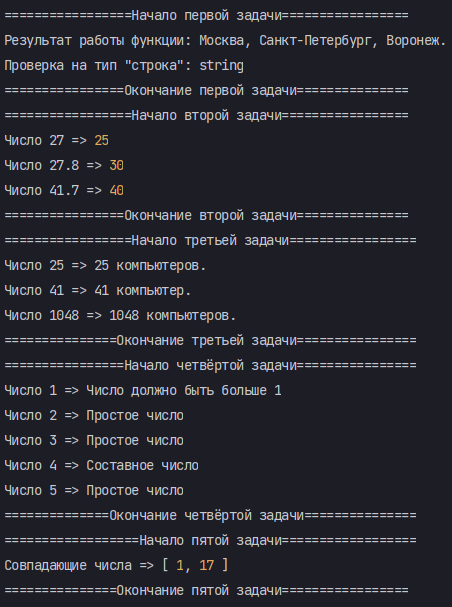

# HOTELS


# Инструкция по запуску:

### 1. Склонируй проект ```git clone git@github.com:Lexlife/hotels.git```.

### 2. Установи зависимости ```npm i```.

### 3. Введи в терминале Bash команду ```tsc index.ts --target ES2020 && node index.js```.

# По итогу, в терминале должен получиться вот такой результат:



# Решение задач на сообразительность находится в файле: ```brainstormingTasks.md```.